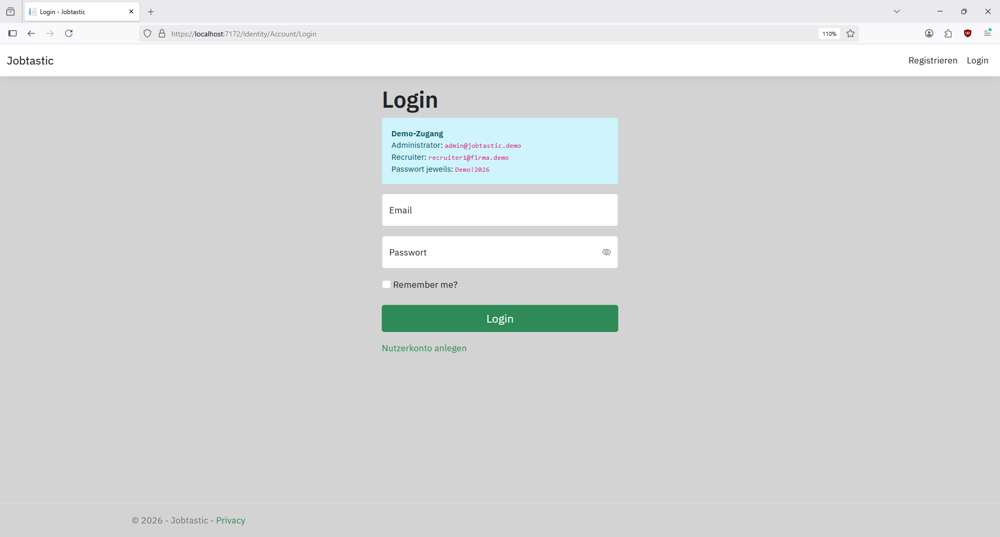
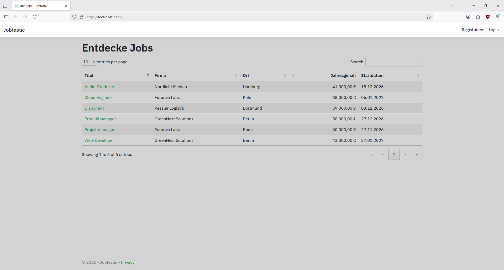
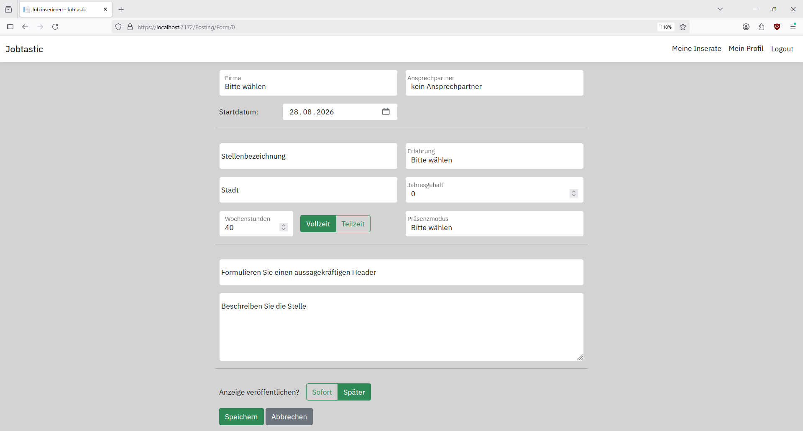
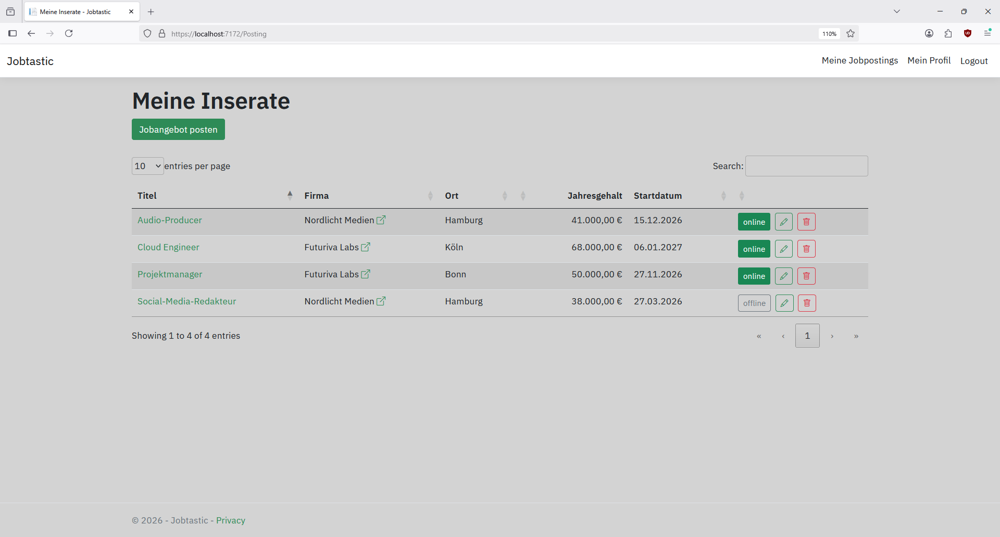
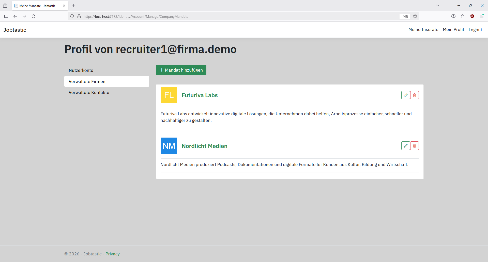
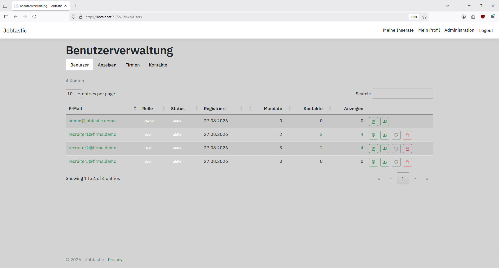

# Jobtastic

**[English](README.md)**

## Über das Projekt

Jobtastic ist im Rahmen meiner Umschulung zur Fachinformatikerin für Anwendungsentwicklung
(IHK) entstanden. Das Projekt zeigt die Anwendung objektorientierter Programmierprinzipien
sowie der Model-View-Controller-Architektur, die für Webanwendungen üblich ist.

KI-Unterstützung fand an folgenden Stellen statt: Claude AI zur
Recherche von Konzepten und zum Debuggen in der frühen Entwicklungsphase, später Claude Code, um das
AJAX-JavaScript, den Administrationsbereich inklusive zentraler Zugriffs-/Berechtigungsprüfung und die Tests zügig umzusetzen.

## Funktionen

Stellenportal mit

- öffentlich zugänglicher Jobbörse
- Recruiter-Bereich (Firmenmandate anlegen, Kontaktpersonen verwalten, Anzeigen schalten)
- Administrationsbereich
- öffentlicher Lese-API
- vorgefertigten Konten für Demo-Zwecke

## Technologien

- ASP.NET Core 8 / Entity Framework Core / ASP.NET Core Identity
- C# / JavaScript / HTML5
- MVC + Razor Pages
- SQL Server / LocalDB
- CSS / Bootstrap 5 / DataTables.net
- AJAX
- jQuery Validation Unobtrusive / SweetAlert2
- NUnit

## Voraussetzungen

- Windows
- .NET 8
- Visual Studio 2022 oder neuer

## Schnellstart (Demo mit localDB)

1. Repository klonen.
2. `Jobtastic` in Visual Studio öffnen.

oder

```bash
dotnet run --project Jobtastic
```

Beim ersten Start werden automatisch:

1. Datenbank angelegt und Model migriert (LocalDB, siehe [Konfiguration](#konfiguration))
2. Rollen `Owner`, `Admin` und `User` angelegt
3. Beispieldaten eingespielt

Schritt 3 läuft **nur in der Entwicklungsumgebung** und **nur, solange die Datenbank leer ist**.


### Demo-Zugang

Für den Zugang zu den User-Funktionen kann eines der aufgeführten Demo-Konten genutzt oder ein neues Nutzerkonto angelegt werden.

> **Hinweis:** Ohne Seeding, bzw. außerhalb der Entwicklungsumgebung
> wird der erste Registrierende zum Owner. Jede weitere Registrierung bekommt nur
> `User`. In der Demo greift das nicht, weil das Seeding bereits Konten anlegt und
> `admin@jobtastic.demo` damit der Owner ist.

Alle Demo-Konten nutzen das Passwort: **`Demo!2026`**

| Rolle | E-Mail |
|---|---|
| Administrator (Owner) | `admin@jobtastic.demo` |
| Recruiter1 | `recruiter1@firma.demo` |
| Recruiter2 | `recruiter2@firma.demo` |
| Recruiter3 (leer) | `recruiter3@firma.demo` |

Bei Programmausführung aus der Entwicklungsumgebung heraus stehen die Zugangsdaten zusätzlich direkt auf der Login-Seite.



## Konfiguration

### Datenbank (eigene SQL-Server-Instanz)

Wird eine eigene SQL-Server-Instanz genutzt, muss ein User-Secret eingerichtet werden, das den Standard (localDB) überschreibt:

```bash
dotnet user-secrets init
dotnet user-secrets set "ConnectionStrings:DefaultConnection" "Data Source=localhost;Initial Catalog=Jobtastic;User ID=sa;Password=DEIN_PASSWORT;TrustServerCertificate=True"
```

### API-Key

In der Entwicklungsumgebung ist bereits der Demo-Key **`Demo!2026-Api`** hinterlegt, die API
funktioniert damit ohne weiteren Einrichtungsschritt. Für einen eigenen Key, bzw. außerhalb der
Entwicklungsumgebung, muss er gesetzt werden:

```bash
dotnet user-secrets set "ApiKey" "DEIN_SCHLUESSEL"
```

> **Hinweis:** Ohne gesetzten Key antwortet die API außerhalb der Entwicklungsumgebung auf
> **jede** Anfrage mit `401`. Siehe
> [Bekannte Einschränkungen](#bekannte-einschränkungen--nötige-verbesserungen)

### Endpunkte

```
GET /api/ApiJobposting/GetAll     alle veröffentlichten Anzeigen
GET /api/ApiJobposting/GetById    eine Anzeige nach ID (Query-Parameter, z. B. ?id=5)
```

Beide erwarten den Header `ApiKey`.

**Beispielaufruf**

```bash
curl -k -H "ApiKey: Demo!2026-Api" "https://localhost:7172/api/ApiJobposting/GetById?id=5"
```

Unter PowerShell ist `curl` nur ein Alias auf `Invoke-WebRequest`; dort stattdessen:

```bash
Invoke-RestMethod -Uri "https://localhost:7172/api/ApiJobposting/GetAll" -Headers @{ ApiKey = "Demo!2026-Api" }
```

**Antwort** (ein Element aus `GetAll`, gekürzt):

```json
[
  {
  "id": 5,
  "company": {
    "id": 3,
    "name": "GreenNest Solutions",
    "websiteURL": "https://greennest.demo"
  },
  "contact": {
    "id": 3,
    "firstName": "John",
    "lastName": "Doe",
    "email": "johndoe@greennest.demo",
    "phone": "+43 89034555"
  },
  "jobTitle": "Produktmanager",
  "header": "Produktmanager (m/w/d) Nachhaltige Haustechnik",
  "jobDescription": "Du übersetzt Kundenbedürfnisse in ..."
  "jobLocation": "Berlin",
  "annualSalary": 58000,
  "fulltime": true,
  "volumeHours": 40,
  "mode": 1,
  "experience": 3,
  "startDate": "2026-12-28T00:00:00"
}
]
```

## Benutzerdokumentation

**Besucher (ohne Login)**
Die ohne Nutzerkonto zugängliche Startseite listet alle Anzeigen, die zur Veröffentlichung freigegeben
und nicht abgelaufen sind. Jeder Eintrag ist mit der Detailansicht der Stellenanzeige verlinkt,
inklusive Kurzprofil der betreffenden Firma und der Kontaktperson (ggf.).


**Recruiter**
Unter „Mein Profil" werden Kontodaten, Firmenmandate und Ansprechpartner für die Anzeigen hinterlegt und
verwaltet. Eingeloggte Nutzer, die mindestens ein Firmenmandat hinterlegt haben, können selbst Anzeigen
inserieren, bearbeiten und wieder löschen. „Meine Inserate" zeigt eine Übersicht aller selbst erstellten
Jobpostings (auch Entwürfe und abgelaufene Anzeigen, welche nicht öffentlich sichtbar sind).




**Administratoren** (`admin@jobtastic.demo`)
Administratoren haben Zugriff auf alle Funktionen eines regulären Userkontos und zusätzlich auf den
Admin-Bereich. Hier finden sich vier Übersichten (Benutzer, Anzeigen, Firmen, Kontakte). In der
Benutzerübersicht können Nutzerkonten gesperrt und entsperrt sowie die Admin-Rolle vergeben und entzogen
werden. Auf Mandate und Kontakte fremder Konten kann über einen Link in der Benutzerübersicht zur
jeweiligen Kontoseite direkt zugegriffen werden. Der Zugriff auf ein fremdes Konto ist durch ein Warnbanner
kenntlich gemacht.


## Projektstruktur

```
Jobtastic/
  Areas/Identity/Pages/     Identity als Razor Pages (Login, Registrierung, Kontoverwaltung)
  Authorization/            Entscheidungslogik: Scopes, Regeln, aktueller Nutzer
  Identity/                 Identity-Ergänzungen: Rollennamen, deutsche Fehlermeldungen
  Controllers/              MVC-Controller inkl. Admin-Bereich und API
  Filters/                  API-Key-Prüfung als Action-Filter
  Services/                 Anwendungslogik, Demodaten-Seeding
  Models/                   Domänenmodelle, Eingabe- und Anzeige-Modelle
  Enums/
  DTO/                      Vertrag der öffentlichen API
  Data/                     DbContext
  Migrations/               EF-Core-Migrationen
  Views/
    Home/                   Jobübersicht, Detailansicht, Datenschutz
    Posting/                „Meine Inserate" und Anzeigenformular
    Admin/                  die vier Übersichten und die Admin-Navigation
    Shared/                 Layout, Fehlerseite, Partials
  wwwroot/
    js/                     AJAX-Handler, Formular- und UI-Verhalten
    css/                    site.css
    lib/                    Client-Bibliotheken (Bootstrap, jQuery, DataTables, SweetAlert2)
TestJobtastic/              NUnit-Tests
```

## Architektur & Designentscheidungen

### Schichtung: MVC, Services und Entscheidungslogik

Controller bilden die HTTP-Grenze, rufen ihnen zugeordnete Views auf und delegieren Interaktionen mit
der Datenbank an entsprechende Services. (Diese hängen an Managern oder dem Interface `ICurrentUser` statt an `HttpContext` und sind
dadurch auch ohne Web-Request testbar.) Die wesentliche Zugriffs- und Entscheidungslogik sowie natürlich die Datenmodelle stehen
isoliert und werden teils Schichtübergreifend aufgerufen.

### Das grundlegende Datenmodell

- Eine Anzeige gehört über `OwnerID` genau einem Nutzer.
- Ein Kontakt gehört einem Nutzer *und* einer Firma: Grundlage für spätere Zuordnungsprüfungen.
- Mandate sind n:m zwischen `User` und `Company`.
- `JobContact` ist reine Datenstruktur und kein Akteur.
- Löschverhalten ist bewusst `Restrict`: Inhalte brechen nicht unter ihrem Besitzer weg (siehe
  [Kontoschließung](#bekannte-einschränkungen--nötige-verbesserungen)).

Insgesamt gibt es drei Modell-Arten/Verträge für drei Zwecke:
1) Domänenmodelle für die Persistenz
2) `JobPostingInputModel` als Positivliste erlaubter Formularfelder
3) `Admin*ListModel` als flache Projektionen für die Übersichten.

Die API projiziert auf `DTO/`-Typen statt Entities.


### Zentrale Berechtigungsprüfung auf zwei Ebenen

Problem: Ein Admin, welcher immer auch User ist, muss Anzeigen anderer User bearbeiten können.

| | Frage | Ort |
|---|---|---|
| **Zugriff** | Welche Zeilen darf ich laden? | `IQueryable`-Scopes in `PostingQueries` |
| **Invariante** | Ist der Zustand gültig? | Prüfung im Service |

Leitsatz: Rollen erweitern den Sichtbereich, ohne die fachlichen Regeln zu verändern.
- **Zugriff** wird im SQL gegen OwnerID gefiltert. (GetJobById liefert für fremde Anzeigen null.)
- Die **Invariante** (der Eigentümer muss ein Mandat für die Firma der Anzeige halten) prüft daher auch gegen den Eigentümer der Anzeige, nicht den
Handelnden.

-> Admin kann fremde Anzeigen bearbeiten.
-> Zugriffsregeln in Service und PostingQueries konsistent / Invariante intakt.

### Rollenmodell

Rollen werden additiv gespeichert:
1) Alle Nutzer sind `User`.
2) Ein User kann zusätzlich `Admin` sein.
3) Ein Admin kann zusätzlich `Owner` sein.

An der Oberfläche sichtbar ist jedoch nur die höchste Rolle, wodurch ein Ein-Rolle-Modell gemimt wird.
Dieser Kompromiss wurde vor dem Hintergrund möglicher Probleme eines wirklich exklusiven Rollenmodells
in ASP.NET Identity, etwa Rollenlosigkeit degradierter Administratoren oder Verdopplung von Schreibvorgängen,
getroffen.

Zusatz: Owner-Schutz. Das Gründerkonto (`Owner`) kann nicht gesperrt oder degradiert werden, was gegen einen
Admin, der den Gründer absetzt, schützt.

### Frontend

Bootstrap 5 für Layout, DataTables.net für Sortieren/Suchen/Blättern, AJAX über `fetch` für
Sperren, Rollenwechsel und Löschen (JSON in denselben Controllern wie die Views), SweetAlert2 für
Rückfragen vor löschenden Aktionen. (AJAX-Handler in `wwwroot/js/` geschrieben mit Claude Code).

---

## Tests

```bash
dotnet test
```

25 NUnit-Tests für die reine Entscheidungslogik. Prüfbar ohne Datenbank oder `HttpContext`.
(`AccountAccessTests`, `PostingQueriesTests`, `AdminUserListModelTests`, `AdminPostingListModelTests`).

## Bekannte Einschränkungen & nötige Verbesserungen

### Funktional

**E-Mail-Funktionen**
- Die in ASP.NET Core Identity angelegten Funktionen Registrierungsbestätigung, Passwort-Reset und Benachrichtigungen
sind gerade noch schlicht auskommentiert. Dadurch gibt es aktuell auch keinen Weg, ein vergessenes Passwort
zurückzusetzen. Dies wäre durch das Einbinden eines E-Mail-Servers zu beheben.

**Kontoschließung**
- Nicht implementiert. Die Fremdschlüssel für Anzeigen und Kontakte stehen auf `Restrict`, weshalb ein Konto
mit Inhalten sich nicht löschen lässt. Eine mögliche Lösung wäre die Anonymisierung der abhängigen Entitäten
plus dauerhafte Sperre des Kontos.

**Verifizierung von Mandaten**
- Jedes Konto kann jede Firma als Mandat beanspruchen. In einem echten System müsste die Berechtigung, für ein
Unternehmen zu inserieren, nachgewiesen werden.

**Geteilte Firmen ohne Änderungsschutz**
- Gerade kann jeder Mandatsträger die Firmendaten als Konsequenz des geteilten Modells still für alle ändern.
Mögliche Lösungen wären eine Historie und Benachrichtigungen oder das Einrichten einer Freigabe.

**Klick-Zähler**
- Das Feld `Klicks` existiert am Modell und wird in der Admin-Übersicht angezeigt. Allerdings ist das Zählen noch
nirgends implementiert, weshalb der Zähler dauerhaft 0 anzeigt.

**Admin-Funktionen**
- Eine dringende Ergänzung des Admin-Bereichs wäre ein Audit-Log, um administrative Eingriffe nachvollziehbar zu machen.
Geplant, aber aus Zeitgründen ausgespart wurden z. B. auch ein Ownership-Transfer von Postings und Kontakten, sowie ein
Firmen-Merge, um mögliche Firmen-Duplikate zusammenzuführen.


### Technisch

**Nutzeroberfläche**
- Das Layout, insbesondere in Bezug auf Barrierefreiheit, bedarf weiterer Ausarbeitung.

**API rudimentär**
- Ursprünglich war das Erstellen einer Api nicht geplant. Sie ist bei einem Exkurs im Unterricht entstanden
und im aktuellen Zustand noch unvollständig. Insbesondere ist kein JsonStringEnumConverter registriert.
System.Text.Json serialisiert die Enums also als ihre Ordinalwerte, wobei die zugeordneten Werte verloren gehen.
Auch gibt es noch keine Versionierung, Paging, Rate-Begrenzung oder eigene Dokumentation.

**Anbindung an Secret-Store**
- Für eine echte Bereitstellung wäre statt User-Secrets z. B. Azure Key Vault beim Start einzubinden.

**Keine datenbankgebundenen Tests**
- Rollenvergabe, Mandatsprüfungen, Sperrlogik und die Admin-Übersichten sind bisher nur manuell verifiziert.

**ungetesteter LocalDB-Pfad**
- Auf dem Entwicklungsrechner überschreibt ein User-Secret die Verbindung, sodass tatsächlich immer gegen
eine SQL-Server-Instanz gearbeitet wurde. Der im Schnellstart beschriebene Weg ist plausibel, aber aus
Zeitgründen noch nicht ausgeführt worden.

**Sprachmischung im Projekt**
- Die Oberfläche wurde entsprechend der Zielgruppe des Projektes auf Deutsch gestaltet. Der Code
inkl. Benennungen und Kommentaren wurde übungshalber auf Englisch verfasst. Insbesondere in den
Commit-Statements auf GitHub kam es jedoch zu sprachlichen Inkonsistenzen, die es in Zukunft
zu vermeiden gilt.


